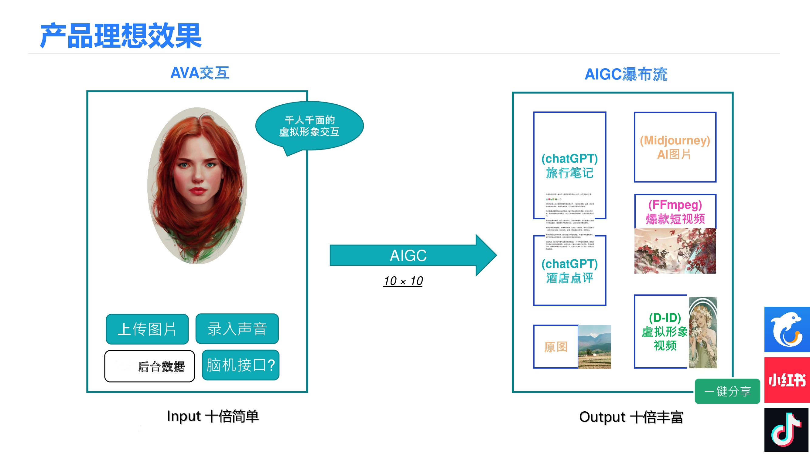
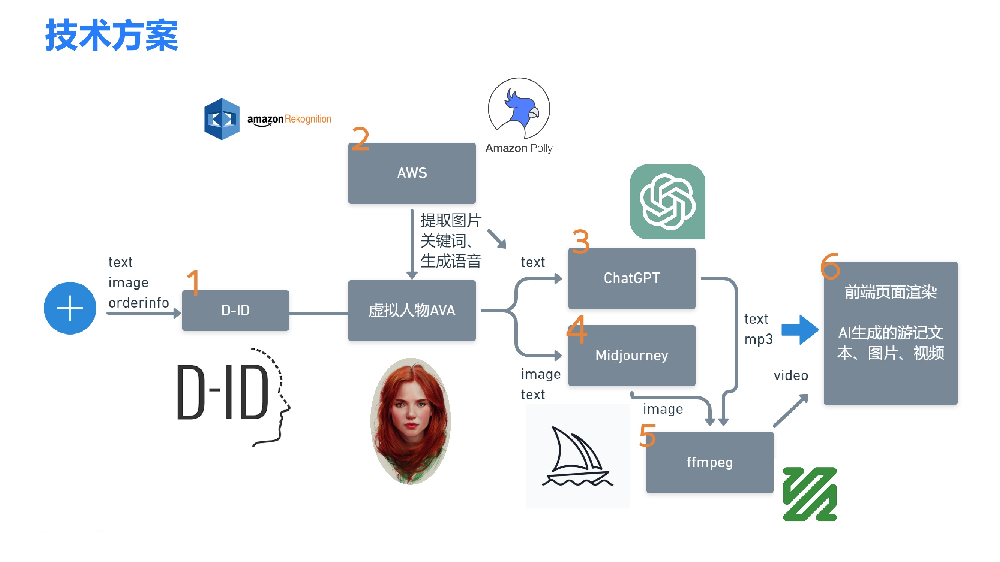

# Trip-AVA - Frontend

> AVA AI Digital Human Travel Guide - Frontend Application

[](https://reactjs.org/)
[](https://www.typescriptlang.org/)
[](https://vitejs.dev/)
[](LICENSE)

**Trip-AVA** 是 AVA AI 数字人向导的前端应用，采用 React 18 + TypeScript 构建，提供豆包风格的极简聊天界面。

## 🖼️ 预览

### 产品效果


### 技术方案


## ✨ 特性

- 🎨 **极简设计** - 豆包风格的纯白背景，专注对话体验
- 🤖 **数字人头像** - 专业的虚拟助手形象
- 💬 **智能对话** - 实时 AI 对话交互
- 🎙️ **语音输入** - 支持语音转文字输入
- 📱 **响应式** - 完美适配桌面和移动端
- 🔧 **Mock 模式** - 开发时无需后端即可测试

## 🛠️ 技术栈

| 技术 | 版本 | 用途 |
|------|------|------|
| React | 18.3.1 | UI 框架 |
| TypeScript | 5.8 | 类型安全 |
| Vite | 5.4.20 | 构建工具 |
| Zustand | 5.0.8 | 状态管理 |
| Tailwind CSS | 3.4.17 | 样式框架 |
| Lucide React | latest | 图标库 |

## 📁 项目结构

```
trip-ava/
├── src/
│   ├── assets/
│   │   └── ava-avatar.png     # 数字人头像
│   ├── components/
│   │   └── ui/
│   │       └── VoiceInputButton.tsx
│   ├── pages/
│   │   └── ChatPage.tsx         # 主聊天页面
│   ├── services/
│   │   ├── api.ts               # API 接口定义
│   │   ├── mockApi.ts           # Mock API
│   │   └── index.ts             # API 服务工厂
│   ├── store/
│   │   ├── chatStore.ts         # 对话状态
│   │   ├── uiStore.ts           # UI 状态
│   │   └── settingsStore.ts     # 用户设置
│   ├── styles/
│   │   └── globals.css          # 全局样式
│   ├── App.tsx
│   └── main.tsx
├── public/
├── index.html
├── vite.config.ts
├── tailwind.config.js
├── tsconfig.json
├── package.json
├── Dockerfile
├── nginx.conf
└── README.md
```

## 🚀 快速开始

### 安装依赖

```bash
npm install
```

### 开发模式

```bash
npm run dev
```

访问 http://localhost:13579/

### 生产构建

```bash
npm run build
```

### 预览构建

```bash
npm run preview
```

## 🔧 环境变量

创建 `.env` 文件：

```env
# API 配置
VITE_API_BASE_URL=http://localhost:8080
VITE_USE_MOCK_API=true

# 功能开关
VITE_ENABLE_VOICE_FEATURES=true
VITE_ENABLE_IMAGE_FEATURES=false
VITE_ENABLE_VIDEO_FEATURES=false
```

## 📡 API 接口

### Chat API

```http
POST /ava/chat
Content-Type: application/json

{
  "sessionId": "conv123",
  "message": "推荐云南的旅行目的地"
}
```

### Voice API

```http
POST /ava/voice
Content-Type: multipart/form-data

audio: [audio file]
sessionId: conv123
```

## 🐳 Docker 部署

```bash
# 构建镜像
docker build -t trip-ava .

# 运行容器
docker run -p 13579:80 trip-ava
```

## 🔗 相关仓库

- **[ava](https://github.com/ava-agent/ava)** - 设计文档 (Private)
- **[trip-ava-aigc](https://github.com/ava-agent/trip-ava-aigc)** - 后端服务

## 📄 许可证

专有软件 - Copyright © 2024

---

**Trip-AVA** - 简洁专注的 AI 旅行向导前端 🚀
